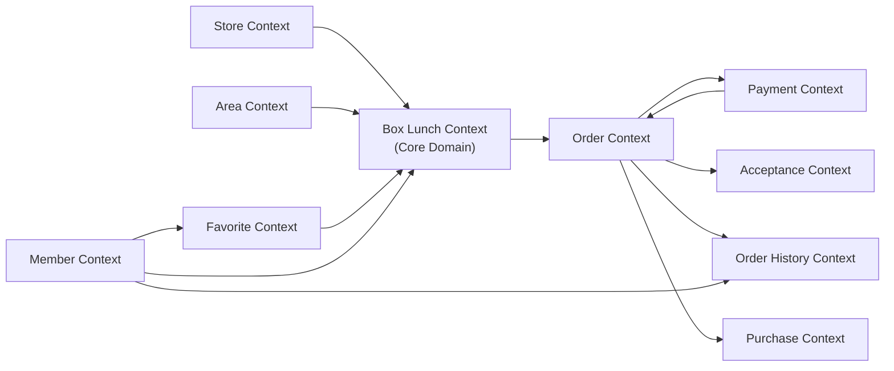

```mermaid
graph LR

%% Core Domain
BoxLunch["Box Lunch Context\n(Core Domain)"]

%% Supporting Subdomains
Store["Store Context"]
Order["Order Context"]
Payment["Payment Context"]
Acceptance["Acceptance Context"]
OrderHistory["Order History Context"]
Purchase["Purchase Context"]

%% Generic Subdomains
Member["Member Context"]
Favorite["Favorite Context"]
Area["Area Context"]

%% Relationships
Store --> BoxLunch
Area --> BoxLunch
Favorite --> BoxLunch
Member --> BoxLunch

BoxLunch --> Order
Order --> Payment
Payment --> Order

Order --> Acceptance
Order --> OrderHistory
Order --> Purchase

Member --> OrderHistory
Member --> Favorite
```