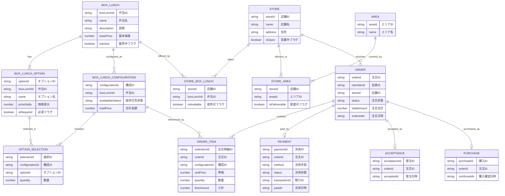

```mermaid
erDiagram

  %% =========================
  %% Box Lunch Context (Core)
  %% =========================
  BOX_LUNCH {
    string boxLunchId "弁当ID"
    string name "弁当名"
    string description "説明"
    number basePrice "基本価格"
    boolean isActive "販売中フラグ"
  }

  BOX_LUNCH_OPTION {
    string optionId "オプションID"
    string boxLunchId "弁当ID"
    string name "オプション名"
    number priceDelta "価格差分"
    boolean isRequired "必須フラグ"
  }

  BOX_LUNCH_CONFIGURATION {
    string configurationId "構成ID"
    string boxLunchId "弁当ID"
    string availabilityStatus "提供可否状態"
    number totalPrice "合計金額"
  }

  OPTION_SELECTION {
    string selectionId "選択ID"
    string configurationId "構成ID"
    string optionId "オプションID"
    number quantity "数量"
  }

  %% =========================
  %% Store / Area (Supporting / Generic)
  %% =========================
  STORE {
    string storeId "店舗ID"
    string name "店舗名"
    string address "住所"
    boolean isOpen "営業中フラグ"
  }

  AREA {
    string areaId "エリアID"
    string name "エリア名"
  }

  %% Store offers Box Lunch
  STORE_BOX_LUNCH {
    string storeId "店舗ID"
    string boxLunchId "弁当ID"
    boolean isAvailable "提供可フラグ"
  }

  %% Area availability (delivery)
  STORE_AREA {
    string storeId "店舗ID"
    string areaId "エリアID"
    boolean isDeliverable "配達可フラグ"
  }

  %% =========================
  %% Order / Payment / Acceptance / Purchase (Supporting)
  %% =========================
  ORDER {
    string orderId "注文ID"
    string memberId "会員ID"
    string storeId "店舗ID"
    string status "注文状態"
    number totalAmount "注文合計"
    string orderedAt "注文日時"
  }

  ORDER_ITEM {
    string orderItemId "注文明細ID"
    string orderId "注文ID"
    string configurationId "構成ID"
    number unitPrice "単価"
    number quantity "数量"
    number lineAmount "小計"
  }

  PAYMENT {
    string paymentId "決済ID"
    string orderId "注文ID"
    string method "決済手段"
    string status "決済状態"
    string transactionId "取引ID"
    string paidAt "決済日時"
  }

  ACCEPTANCE {
    string acceptanceId "受注ID"
    string orderId "注文ID"
    string acceptedAt "受注日時"
  }

  PURCHASE {
    string purchaseId "購入ID"
    string orderId "注文ID"
    string confirmedAt "購入確定日時"
  }

  %% =========================
  %% Relationships
  %% =========================
  BOX_LUNCH ||--|{ BOX_LUNCH_OPTION : has
  BOX_LUNCH ||--o{ BOX_LUNCH_CONFIGURATION : configured_as
  BOX_LUNCH_CONFIGURATION ||--|{ OPTION_SELECTION : includes
  BOX_LUNCH_OPTION ||--o{ OPTION_SELECTION : selected_in

  STORE ||--|{ STORE_BOX_LUNCH : offers
  BOX_LUNCH ||--|{ STORE_BOX_LUNCH : offered_by

  STORE ||--|{ STORE_AREA : delivers_to
  AREA  ||--|{ STORE_AREA : covered_by

  STORE ||--o{ ORDER : receives
  ORDER ||--|{ ORDER_ITEM : contains
  BOX_LUNCH_CONFIGURATION ||--o{ ORDER_ITEM : referenced_by

  ORDER ||--o| PAYMENT : paid_by
  ORDER ||--o| ACCEPTANCE : accepted_as
  ORDER ||--o| PURCHASE : purchased_as
```