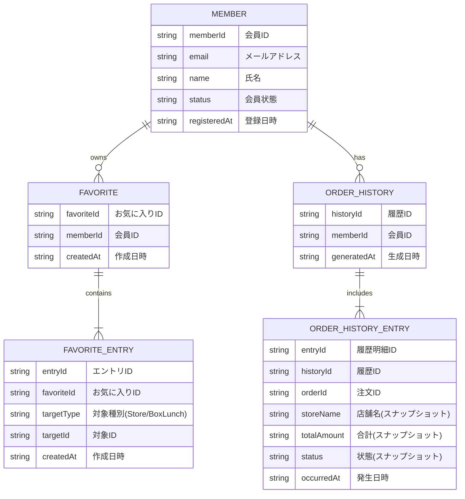

```mermaid
erDiagram

  %% =========================
  %% Member Context (Generic)
  %% =========================
  MEMBER {
    string memberId "会員ID"
    string email "メールアドレス"
    string name "氏名"
    string status "会員状態"
    string registeredAt "登録日時"
  }

  %% =========================
  %% Favorite Context (Generic)
  %% =========================
  FAVORITE {
    string favoriteId "お気に入りID"
    string memberId "会員ID"
    string createdAt "作成日時"
  }

  FAVORITE_ENTRY {
    string entryId "エントリID"
    string favoriteId "お気に入りID"
    string targetType "対象種別(Store/BoxLunch)"
    string targetId "対象ID"
    string createdAt "作成日時"
  }

  %% =========================
  %% Order History Context (Read Model)
  %% =========================
  ORDER_HISTORY {
    string historyId "履歴ID"
    string memberId "会員ID"
    string generatedAt "生成日時"
  }

  ORDER_HISTORY_ENTRY {
    string entryId "履歴明細ID"
    string historyId "履歴ID"
    string orderId "注文ID"
    string storeName "店舗名(スナップショット)"
    string totalAmount "合計(スナップショット)"
    string status "状態(スナップショット)"
    string occurredAt "発生日時"
  }

  %% =========================
  %% Relationships
  %% =========================
  MEMBER ||--o{ FAVORITE : owns
  FAVORITE ||--|{ FAVORITE_ENTRY : contains

  MEMBER ||--o{ ORDER_HISTORY : has
  ORDER_HISTORY ||--|{ ORDER_HISTORY_ENTRY : includes
```