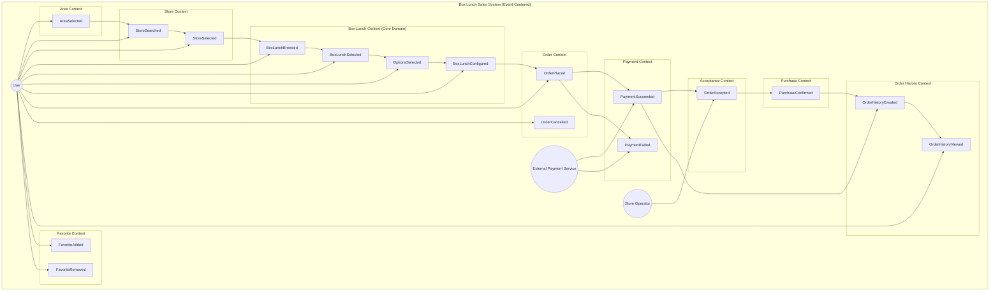

```mermaid
graph TB

subgraph "Box Lunch Sales System (Event-Centered)"
    User((User))
    StoreOperator((Store Operator))
    PaymentService((External Payment Service))

    %% --- Generic / Supporting contexts that produce events ---
    subgraph "Area Context"
        AreaSelected[AreaSelected]
    end

    subgraph "Store Context"
        StoreSearched[StoreSearched]
        StoreSelected[StoreSelected]
    end

    subgraph "Box Lunch Context (Core Domain)"
        BoxLunchBrowsed[BoxLunchBrowsed]
        BoxLunchSelected[BoxLunchSelected]
        OptionsSelected[OptionsSelected]
        BoxLunchConfigured[BoxLunchConfigured]
    end

    subgraph "Order Context"
        OrderPlaced[OrderPlaced]
        OrderCancelled[OrderCancelled]
    end

    subgraph "Payment Context"
        PaymentSucceeded[PaymentSucceeded]
        PaymentFailed[PaymentFailed]
    end

    subgraph "Acceptance Context"
        OrderAccepted[OrderAccepted]
    end

    subgraph "Purchase Context"
        PurchaseConfirmed[PurchaseConfirmed]
    end

    subgraph "Order History Context"
        OrderHistoryCreated[OrderHistoryCreated]
        OrderHistoryViewed[OrderHistoryViewed]
    end

    subgraph "Favorite Context"
        FavoriteAdded[FavoriteAdded]
        FavoriteRemoved[FavoriteRemoved]
    end
end

%% =========================
%% Actor -> Event (trigger)
%% =========================
User --> AreaSelected
User --> StoreSearched
User --> StoreSelected
User --> BoxLunchBrowsed
User --> BoxLunchSelected
User --> OptionsSelected
User --> BoxLunchConfigured
User --> OrderPlaced
User --> OrderCancelled
User --> OrderHistoryViewed
User --> FavoriteAdded
User --> FavoriteRemoved

PaymentService --> PaymentSucceeded
PaymentService --> PaymentFailed

StoreOperator --> OrderAccepted

%% =========================
%% Event flow (causal chain)
%% =========================
AreaSelected --> StoreSearched
StoreSearched --> StoreSelected

StoreSelected --> BoxLunchBrowsed
BoxLunchBrowsed --> BoxLunchSelected
BoxLunchSelected --> OptionsSelected
OptionsSelected --> BoxLunchConfigured

BoxLunchConfigured --> OrderPlaced

OrderPlaced --> PaymentSucceeded
OrderPlaced --> PaymentFailed

PaymentSucceeded --> OrderAccepted
OrderAccepted --> PurchaseConfirmed

%% Read model projection examples
PaymentSucceeded --> OrderHistoryCreated
PurchaseConfirmed --> OrderHistoryCreated
OrderHistoryCreated --> OrderHistoryViewed
```