# UserContext 構造と依存関係

## ディレクトリ構成

```mermaid
graph TD
    A[UserContext] --> B[User]
    B --> C[Adapter]
    B --> D[Domain]
    B --> E[Infrastructure]
    B --> F[Usecase]
    
    C --> C1[Controller]
    C1 --> C1A[UserController.php]
    
    D --> D1[User.php]
    D --> D2[UserRepositoryInterface.php]
    D --> D3[ValueObject]
    D3 --> D3A[UserName.php]
    D3 --> D3B[UserEmail.php]
    D3 --> D3C[UserPassword.php]
    
    E --> E1[Eloquent]
    E1 --> E1A[EloquentUser.php]
    E1 --> E1B[UserRepository.php]
    
    F --> F1[Create]
    F --> F2[Update]
    F --> F3[List]
    F --> F4[Delete]
    
    F1 --> F1A[ICreateUserUseCase.php]
    F1 --> F1B[CreateUserInteractor.php]
    F1 --> F1C[CreateUserInputData.php]
    
    F2 --> F2A[IUpdateUserUseCase.php]
    F2 --> F2B[UpdateUserInteractor.php]
    F2 --> F2C[UpdateUserInputData.php]
    
    F3 --> F3A[IListUsersUseCase.php]
    F3 --> F3B[ListUsersInteractor.php]
    F3 --> F3C[ListUsersOutputData.php]
    
    F4 --> F4A[IDeleteUserUseCase.php]
    F4 --> F4B[DeleteUserInteractor.php]
    F4 --> F4C[DeleteUserInputData.php]
```



## 依存関係図

```mermaid
graph TB
    subgraph "Adapter Layer"
        UC[UserController]
    end
    
    subgraph "UseCase Layer"
        ICreate[ICreateUserUseCase]
        IUpdate[IUpdateUserUseCase]
        IList[IListUsersUseCase]
        IDelete[IDeleteUserUseCase]
        
        CreateInteractor[CreateUserInteractor]
        UpdateInteractor[UpdateUserInteractor]
        ListInteractor[ListUsersInteractor]
        DeleteInteractor[DeleteUserInteractor]
        
        CreateInput[CreateUserInputData]
        UpdateInput[UpdateUserInputData]
        ListOutput[ListUsersOutputData]
        DeleteInput[DeleteUserInputData]
    end
    
    subgraph "Domain Layer"
        UserEntity[User Entity]
        UserRepoInterface[UserRepositoryInterface]
        UserNameVO[UserName ValueObject]
        UserEmailVO[UserEmail ValueObject]
        UserPasswordVO[UserPassword ValueObject]
    end
    
    subgraph "Infrastructure Layer"
        EloquentUser[EloquentUser Model]
        UserRepository[UserRepository]
    end
    
    %% Controller dependencies
    UC -->|uses| IList
    UC -->|uses| IUpdate
    UC -->|uses| IDelete
    UC -->|uses| UpdateInput
    UC -->|uses| DeleteInput
    
    %% UseCase implementations
    CreateInteractor -.->|implements| ICreate
    UpdateInteractor -.->|implements| IUpdate
    ListInteractor -.->|implements| IList
    DeleteInteractor -.->|implements| IDelete
    
    %% UseCase dependencies
    CreateInteractor -->|uses| UserEntity
    CreateInteractor -->|uses| UserRepoInterface
    CreateInteractor -->|uses| CreateInput
    
    UpdateInteractor -->|uses| EloquentUser
    UpdateInteractor -->|uses| UpdateInput
    
    ListInteractor -->|uses| EloquentUser
    ListInteractor -->|returns| ListOutput
    
    DeleteInteractor -->|uses| EloquentUser
    DeleteInteractor -->|uses| DeleteInput
    
    %% Repository dependencies
    UserRepository -.->|implements| UserRepoInterface
    UserRepository -->|uses| UserEntity
    UserRepository -->|uses| EloquentUser
    
    %% ValueObject usage (potential)
    UserEntity -.->|may use| UserNameVO
    UserEntity -.->|may use| UserEmailVO
    UserEntity -.->|may use| UserPasswordVO
    
    style UC fill:#e1f5ff
    style CreateInteractor fill:#fff4e1
    style UpdateInteractor fill:#fff4e1
    style ListInteractor fill:#fff4e1
    style DeleteInteractor fill:#fff4e1
    style UserEntity fill:#e8f5e9
    style UserRepoInterface fill:#e8f5e9
    style UserNameVO fill:#e8f5e9
    style UserEmailVO fill:#e8f5e9
    style UserPasswordVO fill:#e8f5e9
    style EloquentUser fill:#fce4ec
    style UserRepository fill:#fce4ec
```



## レイヤー別説明

### Adapter Layer (Controller)
- **UserController**: HTTPリクエストを受け取り、UseCaseを呼び出す

### UseCase Layer
- **Create**: ユーザー作成
- **Update**: ユーザー更新
- **List**: ユーザー一覧取得
- **Delete**: ユーザー削除

各UseCaseは以下の構成：
- Interface: UseCaseのインターフェース
- Interactor: UseCaseの実装
- InputData/OutputData: 入出力データ

### Domain Layer
- **User**: エンティティ
- **UserRepositoryInterface**: リポジトリのインターフェース
- **ValueObject**: 値オブジェクト（UserName, UserEmail, UserPassword）

### Infrastructure Layer
- **EloquentUser**: Eloquentモデル
- **UserRepository**: リポジトリの実装

## 依存関係の方向

```
Controller → UseCase → Domain ← Infrastructure
```

- ControllerはUseCaseに依存
- UseCaseはDomainに依存
- InfrastructureはDomainのインターフェースを実装
- Domainは他のレイヤーに依存しない（依存性逆転の原則）


